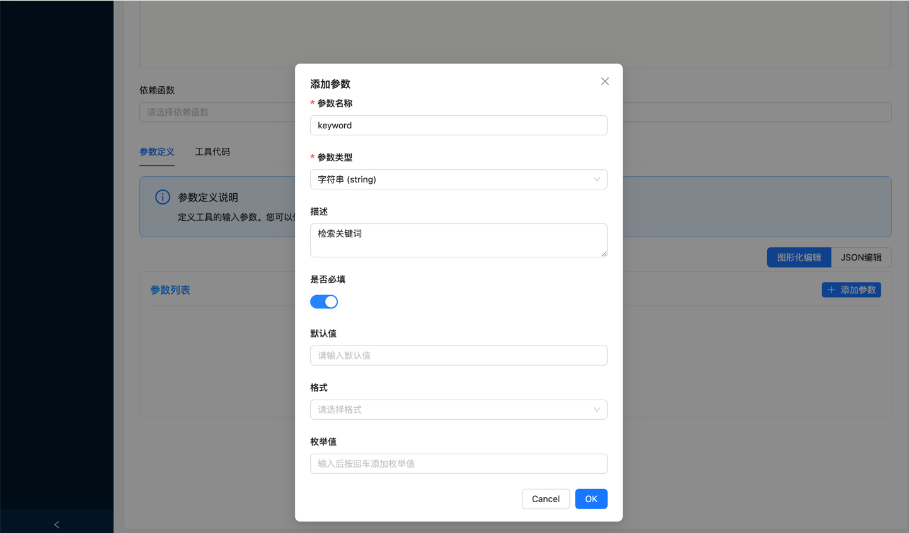

# 数据库工具使用指南

## 概述

数据库工具是一个强大的数据查询和操作工具，支持多种数据库类型，包括 MySQL、PostgreSQL、SQLite、Apache Doris、ClickHouse 和 Oracle。它提供了统一的接口来执行 SQL 查询，并返回结构化的结果数据。
借助数据库工具，您可以通过几个配置轻松的创建一个属于你的MCP Tool。

## 主要特性

### 🔗 多数据库支持
- **MySQL**: 支持 MySQL 5.7+ 版本
- **PostgreSQL**: 支持 PostgreSQL 10+ 版本
- **SQLite**: 支持 SQLite 3.x 版本
- **Doris**: 支持 Apache Doris 2.0+ 版本（使用 MySQL 协议）
- **ClickHouse**: 支持 ClickHouse 20.0+ 版本（使用 HTTP 接口）
- **Oracle**: 支持 Oracle 11g+ 版本（使用 Oracle 客户端）
- 持续增加中......

### 📊 结构化数据返回
- 统一的 JSON 格式返回
- 包含列信息和描述
- 支持复杂数据类型

## 创建数据库工具

### 步骤1: 进入工具管理页面，选择创建“数据库工具”

点击"创建工具"按钮，在下拉菜单中选择"数据库工具"。


### 步骤2: 填写基本信息


#### 必填字段
- **工具名称**: 为工具起一个有意义的名称
- **工具描述**: 简要描述工具的用途和功能
- **数据库URL**: 输入数据库连接地址，如 `jdbc:mysql://localhost:3306/mydb`、`jdbc:postgresql://localhost:5432/mydb`、`jdbc:sqlite:mydb.db`、`jdbc:doris://localhost:9030/mydb`、`jdbc:clickhouse://localhost:8123/mydb`、`jdbc:oracle://localhost:1521/XE`
- **用户名**: 数据库登录用户名
- **密码**: 数据库登录密码

### 步骤3: 编写SQL查询

#### SQL 编辑器特性
- 语法高亮显示
- 自动补全功能
- 支持 MyBatis 动态 SQL 语法

#### 动态SQL示例
```sql
SELECT 
    id, name, email, created_at
FROM users 
<where>
    <if test="keyword != null">
        AND (name LIKE CONCAT('%', #{keyword}, '%') 
             OR email LIKE CONCAT('%', #{keyword}, '%'))
    </if>
</where>
ORDER BY created_at DESC
LIMIT 1
```

### 步骤4: 定义参数



#### 参数定义示例
```json
{
  "type": "object",
  "properties": {
    "keyword": {
      "type": "string",
      "description": "检索关键词"
    }
  },
  "required": [
    "keyword"
  ]
}
```

## 调试数据库工具

### 调试数据库工具


#### 返回数据格式
```json
{
  "columns": [
    {"name": "id", "description": "用户ID"},
    {"name": "name", "description": "用户姓名"},
    {"name": "email", "description": "邮箱地址"},
    {"name": "created_at", "description": "创建时间"}
  ],
  "rows": [
    {
      "id": 1,
      "name": "张三",
      "email": "zhangsan@example.com",
      "created_at": "2024-01-15 10:30:00"
    },
    {
      "id": 2,
      "name": "李四",
      "email": "lisi@example.com",
      "created_at": "2024-01-16 14:20:00"
    }
  ],
  "row_count": 2
}
```

## 附：MyBatis 动态 SQL语法

数据库工具支持 MyBatis 风格的动态 SQL 语法，让您可以根据参数动态构建查询。

#### 支持的标签
- `<if>`: 条件判断
- `<where>`: 智能WHERE子句
- `<choose>`, `<when>`, `<otherwise>`: 多条件选择
- `<trim>`: 字符串修剪
- `<foreach>`: 循环处理

#### 条件表达式
- `!= null`: 非空判断
- `== 'value'`: 等值判断
- `> 0`: 数值比较

### 参数绑定

#### 绑定语法
- `#{paramName}`: 参数占位符
- 自动类型转换

## 🔗 数据库连接示例

### MySQL
```
jdbc:mysql://localhost:3306/mydb
```

### PostgreSQL
```
jdbc:postgresql://localhost:5432/mydb
```

### SQLite
```
jdbc:sqlite:mydb.db
```

### Apache Doris
```
jdbc:doris://localhost:9030/mydb
```

### ClickHouse
```
jdbc:clickhouse://localhost:8123/mydb
```

### Oracle
```
jdbc:oracle://localhost:1521/XE
```

**注意事项**：
- Doris 使用 MySQL 协议，默认查询端口为 9030
- Doris 支持标准 SQL 语法，兼容 MySQL 语法
- 建议使用 Doris 的查询端口（9030）而不是 HTTP 端口（8030）
- ClickHouse 使用 HTTP 接口，默认端口为 8123
- ClickHouse 支持标准 SQL 语法，专为 OLAP 场景优化
- ClickHouse 具有出色的列式存储和压缩性能
- Oracle 使用专用客户端连接，默认端口为 1521
- Oracle 支持完整的 SQL 标准和企业级功能
- 需要安装 Oracle 客户端库才能使用

## 📚 更多信息

- [快速开始](doc/快速开始.md) - 快速开始部署指南

*Easy MCP - 让MCP工具开发变得简单高效！*