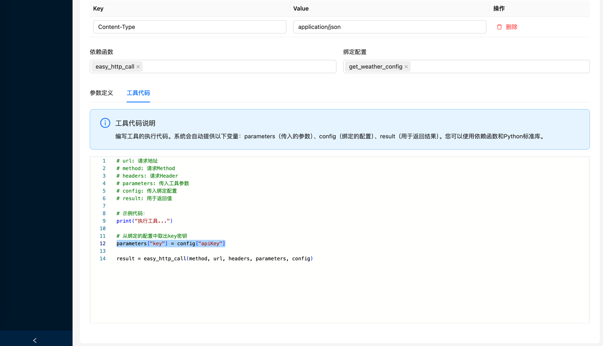

# HTTP 工具使用指南

## 概述

HTTP工具是一个强大的 API 调用和数据交互工具，支持所有标准的 HTTP 方法（GET、POST、PUT、DELETE 等）。它提供了灵活的参数配置、请求头管理和响应处理功能，让您可以轻松地与各种 REST API 和 Web 服务进行交互。

借助HTTP工具，您可以通过几个配置轻松的创建一个属于你的MCP Tool。

## 主要特性

### 🌐 全面的 HTTP 支持
- **GET**: 获取数据和资源
- **POST**: 创建新资源或提交数据
- **PUT**: 更新现有资源
- **DELETE**: 删除资源

### 🔧 灵活的参数处理
- URL 路径参数替换
- 查询字符串参数
- 请求体参数
- 请求头参数动态设置

### 📊 智能响应处理
- 自动 JSON 解析
- 文本内容处理
- HTTP 状态码处理
- 错误响应处理

## 创建 HTTP 工具

### 步骤1: 进入工具管理页面，选择创建"HTTP工具"。


### 步骤2: 填写基本信息


#### 必填字段
- **工具名称**: 为工具起一个有意义的名称
- **工具描述**: 简要描述工具的用途和功能
- **HTTP 方法**: 选择请求方法（GET、POST、PUT、DELETE等）
- **请求 URL**: 输入 API 端点地址
- **请求头**: 配置必要的请求头信息

#### URL 参数化示例
```
https://restapi.amap.com/v3/weather/weatherInfo?city={city}&key={key}&extensions=base
```

#### 常用请求头
- **Content-Type**: 指定请求体格式
  - `application/json`: JSON 数据
  - `application/x-www-form-urlencoded`: 表单数据
  - `multipart/form-data`: 文件上传
- **Authorization**: 身份认证
  - `Bearer {token}`: JWT Token
  - `Basic {credentials}`: 基础认证

### 步骤3: 定义参数


#### 参数位置说明

- **url**: URL 路径参数，用于替换 URL 中的 `{paramName}`，将变量占位符替换为参数值
- **body**: 请求体参数，用于 POST/PUT 请求
- **header**: 请求头参数，用于动态设置请求中的`{paramName}`，将变量占位符替换为参数值

#### 参数定义示例
```json
{
  "type": "object",
  "properties": {
    "city": {
      "type": "string",
      "description": "查询目标城市",
      "location": "url"
    },
    "key": {
      "type": "string",
      "description": "",
      "location": "url"
    }
  },
  "required": [
    "city",
    "key"
  ]
}
```

## 调试 HTTP 工具

### 调试 HTTP 工具界面


#### 响应数据
```json
{
  "status": "1",
  "count": "1",
  "info": "OK",
  "infocode": "10000",
  "lives": [
    {
      "province": "上海",
      "city": "上海市",
      "adcode": "310000",
      "weather": "阴",
      "temperature": "30",
      "winddirection": "西",
      "windpower": "≤3",
      "humidity": "67",
      "reporttime": "2025-06-20 10:01:09",
      "temperature_float": "30.0",
      "humidity_float": "67.0"
    }
  ]
}
```

## 高阶使用

在上面的示例中，我们使用了一个简单的GET请求，创建了一个天气工具。这个工具并定义了2个参数：city目标城市和key调用密钥。
其中key参数作为认证密钥是完全不合适作为MCP Tool的参数的，因为不可能也不应该交给LLM大模型推理得出需要的密钥key！
如果要解决这个问题，我们可以使用配置管理功能，将密钥保存为配置项，作为工具的服务配置，而不是工具参数。

下面我就介绍如何使用配置管理功能来解决这个问题：

### 创建配置

进入配置管理页面，点击「创建配置」按钮


### 填写配置信息


#### 必填字段

- **配置名称**: 为配置起一个有意义的名称
- **配置描述**: 简要描述配置用途和功能
- **配置参数**: 设置配置项定义

### 配置参数定义


创建配置项

```json
{
  "type": "object",
  "properties": {
    "apiKey": {
      "type": "string",
      "description": "高德apiKey"
    }
  },
  "required": [
    "city"
  ]
}
```

### 设置配置值

进入配置管理页面，点击「配置」按钮


### 给工具绑定配置

编辑上面的Http工具，设置绑定配置


### 修改工具代码

修改工具代码，将配置项替换为配置项的值



```python
# url: 请求地址
# method: 请求Method
# headers: 请求Header
# parameters: 传入工具参数
# config: 传入绑定配置
# result: 用于返回值

# 示例代码：
print("执行工具...")

# 从绑定的配置中取出key密钥
parameters["key"] = config["apiKey"]

result = easy_http_call(method, url, headers, parameters, config)
```

### 修改工具参数

修改工具参数，将key参数移除


### 调试工具

测试工具，查看结果，可以看到工具不再需要key参数了


## 📚 更多信息

- [快速开始](doc/快速开始.md) - 快速开始部署指南

*Easy MCP - 让MCP工具开发变得简单高效！*